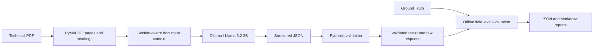

# AI Tool Evaluation for Technical Document Analysis

## Overview

This portfolio project evaluates a local GenAI workflow that extracts structured information from technical documents and cites its source sections. The inference API extracts PDF text, sends page and detected-heading context to Ollama running Llama 3.2 3B, and validates the returned JSON with Pydantic. A separate evaluation step compares saved inference output with manually prepared Ground Truth.

The current input is a fictional, 20-page battery module specification and validation report. It includes production requirements alongside prototype and historical values, test measurements, operating and storage conditions, and other plausible distractors. It is evaluation material, not a real product document.

## Why this project

Technical facts are often spread across a document, and similar values can refer to different revisions, configurations, conditions, or test contexts. This project measures whether a local model workflow retrieves the intended information while preserving technical qualifiers and section references.

## Architecture



Ground Truth is only read by the separate offline evaluation step; it is never included in inference context.

## Key Features

- PDF text extraction with page numbers and detected section-heading context
- Local Ollama inference using Llama 3.2 3B
- JSON Schema-constrained model output and Pydantic validation
- Structured field values, qualifiers, confidence, and source-section references
- Separate preservation of raw model output and validated results
- FastAPI `POST /analyze` and `GET /health` endpoints
- Ground Truth comparison for core values, completeness, source correctness, and latency
- Automated tests that do not require Ollama to be running

## Tech Stack

| Technology | Use |
|---|---|
| Python | Application and evaluation code |
| FastAPI | Local HTTP API |
| PyMuPDF | PDF text extraction |
| Ollama + Llama 3.2 3B | Local inference |
| Pydantic | Structured output validation |
| httpx | Local Ollama HTTP requests |
| pytest | Automated tests |
| Git / GitHub | Version control |

## Evaluation Setup

- One fictional, 20-page engineering document and 15 extraction fields
- Revision C production release is the Ground Truth configuration
- Prototype, historical, measured, shipping, and planning values provide realistic context and distractors
- Ground Truth is manually defined and never supplied to the model during inference

## Results

Results below are from the saved Llama 3.2 3B inference run evaluated in this repository.

| Metric | Result |
|---|---:|
| Core extraction accuracy | 15/15 (100.0%) |
| Completeness | 13.3% |
| Source correctness | 14/15 (93.3%) |
| End-to-end latency | 107.98 s |
| Model request latency | 107.61 s |

The model returned all 15 core values correctly, but several answers omitted important qualifiers or operating conditions, and one source citation was incorrect. Correct value retrieval did not guarantee that the output preserved complete technical context.

## Example Findings

- The cycle-life answer omitted the 80% retained-capacity endpoint.
- The isolation answer omitted the 500 V DC test voltage.
- The SOC indication issue omitted the rapid-load-change trigger.
- The SOC window cited section 3.3 instead of authoritative section 3.2.

## Project Structure

```text
ai-tool-evaluation/
├── app/
│   ├── api/                   # FastAPI routes
│   ├── prompts/               # Analysis prompt
│   ├── services/              # PDF extraction, analysis, Ollama client
│   ├── main.py
│   └── schemas.py
├── data/
│   ├── documents/             # Fictional evaluation PDF
│   ├── ground_truth/          # Separate answer key
│   └── results/               # Raw, validated, and evaluation outputs
├── docs/document-drafts/      # Markdown source for the fictional report
├── evaluation/                # Lightweight offline metrics and runner
├── tests/
├── pyproject.toml
└── README.md
```

## Running Locally

Clone the repository and install the project with its test dependencies:

```bash
git clone https://github.com/HuanLiu2022/ai-tool-evaluation.git
cd ai-tool-evaluation
# Requires Python 3.10 or newer.
python -m venv .venv
source .venv/bin/activate
python -m pip install -e '.[dev]'
```

If Ollama is not already running, start it in a separate terminal:

```bash
ollama serve
```

Then check that the model is available; pull it locally if it is missing:

```bash
ollama list
ollama pull llama3.2:3b
```

Run the tests and start the API:

```bash
pytest
uvicorn app.main:app --reload
```

In another terminal, check the API and analyze the included PDF:

```bash
curl http://127.0.0.1:8000/health
curl -X POST http://127.0.0.1:8000/analyze \
  -F 'file=@data/documents/battery-module-technical-specification-validation-report.pdf'
```

Each analysis saves a uniquely named raw response and validated JSON under `data/results/`. Run the lightweight evaluation against the documented baseline result with:

```bash
python -m evaluation.run
```

To evaluate another saved inference result, pass its path with `--result`:

```bash
python -m evaluation.run --result path/to/validated-result.json
```

Inference uses only the local Ollama service; no paid or cloud API is required.

## Limitations

- The current evaluation uses one fictional document and one local model.
- Metrics are a lightweight field-level evaluation, not a comprehensive benchmark.
- Confidence values are not calibrated, and there is no robustness benchmark yet.
- The fictional document does not represent proprietary real-world engineering data.

## License and Data Note

The engineering document is fictional and was created solely for evaluation purposes. No license file is currently included in the repository.
